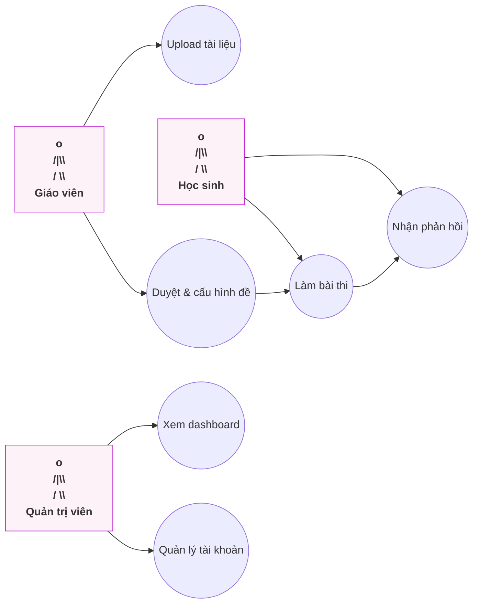
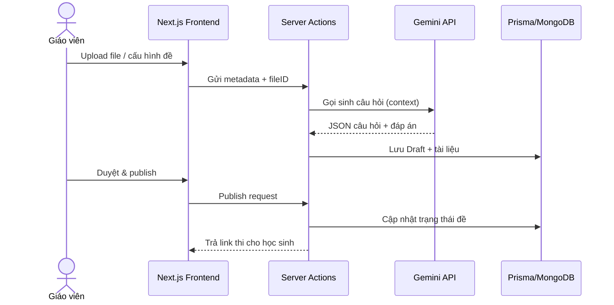
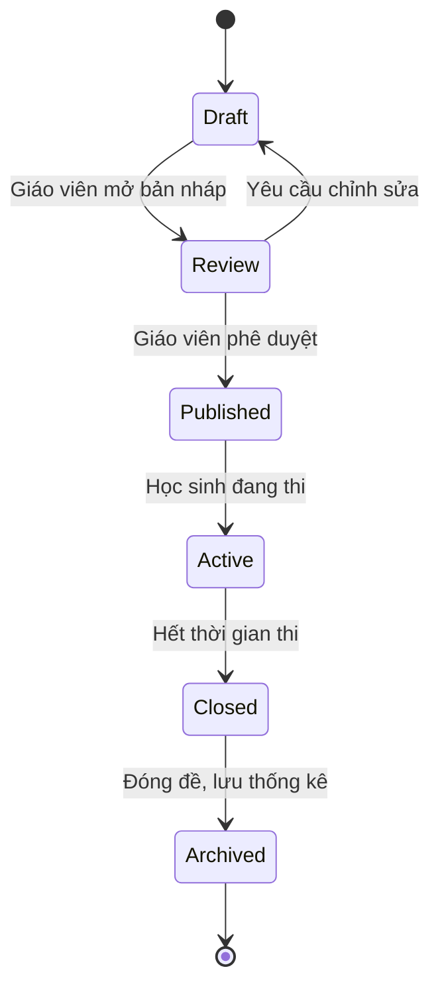
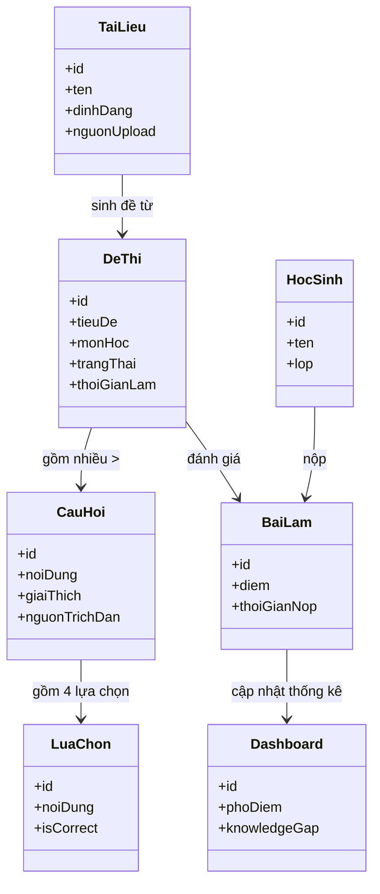
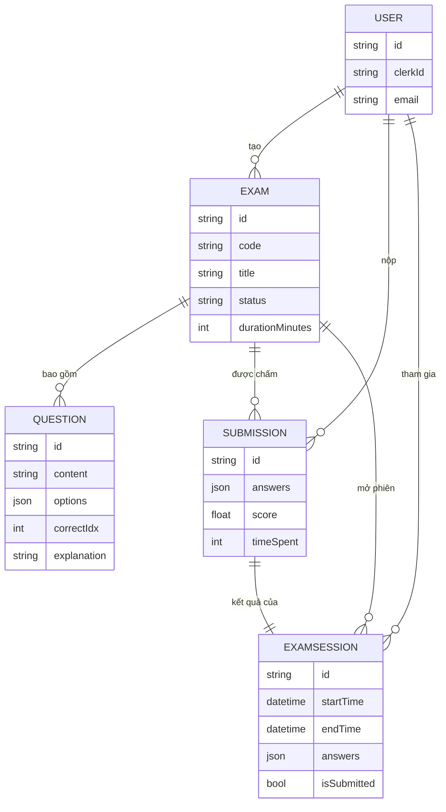

# Báo cáo Equiz MVP – Danang AI4Life

## CHƯƠNG 1: GIỚI THIỆU

### 1.1. Lý do chọn đề tài

#### Vấn đề thực tế

Giáo viên phổ thông mất nhiều giờ để chuyển đổi giáo trình thành bộ đề chuẩn, trong khi học sinh thiếu phản hồi tức thời sau mỗi lần làm bài. Những nền tảng hiện có (Azota, Shub, Quizizz) không thể sinh đề trực tiếp từ tài liệu gốc nên khó đảm bảo tính minh bạch và nguồn tham chiếu. Ví dụ, để tạo một đề 40 câu cho kỳ kiểm tra giữa kỳ, giáo viên phải: (1) quét lại tài liệu, (2) gõ tay từng câu hỏi, (3) rà soát độ chính xác và (4) chấm bài bằng Excel thủ công. Quy trình này không chỉ tốn 3–4 giờ mà còn dễ sai sót, khó truy vết nguồn nội dung khi phụ huynh cần giải thích.

#### Giải pháp của ứng dụng

Equiz xây dựng pipeline 4 giai đoạn: thu nhận đa định dạng, tiền xử lý, sinh nội dung bằng Gemini 2.0 Flash và lưu trữ – phân tích kết quả. Ứng dụng tập trung vào giáo dục chính quy, cung cấp câu hỏi kèm đáp án, giải thích và nguồn trích dẫn, đồng thời cho phép giáo viên duyệt và chỉnh sửa trước khi phát hành. Ở bước sinh đề, AI trả về JSON có cấu trúc đầy đủ (question, choices, correctAnswer, explanation, referenceDoc) giúp backend hiển thị ngay. Giai đoạn phân tích kết quả sử dụng dữ liệu bài làm để xây dựng heatmap kiến thức yếu, hỗ trợ giáo viên phân bổ lại thời lượng giảng dạy.

#### Ý nghĩa/tính cần thiết

Giải pháp đáp ứng các tiêu chí Danang AI4Life một cách cụ thể:

- **Tính độc đáo:** Tự động hóa hoàn toàn từ tài liệu gốc đến câu hỏi minh bạch có nguồn, có bước duyệt thủ công để đảm bảo chất lượng.
- **Tính phù hợp công nghệ:** Kết hợp Google AI File API, Gemini 2.0 Flash, Next.js và Prisma để xử lý pipeline AI-native đúng với hạ tầng đã triển khai.
- **Tính đầy đủ tính năng:** Bao trùm sinh đề, quản lý đề, thi – chấm điểm tự động, dashboard phân tích và log kiểm duyệt.
- **Tính hiệu quả:** Rút ngắn thời gian tạo đề xuống 10–15 phút, cung cấp phản hồi tức thì giúp cải thiện kết quả học tập.

### 1.2. Kế hoạch thực hiện

#### Mục tiêu chính

Hoàn thiện MVP đáp ứng quy trình: giáo viên upload tài liệu → AI sinh đề chuẩn hóa → giáo viên duyệt/cấu hình → học sinh thi và nhận phản hồi ngay → dashboard phân tích cho nhà trường. Song song đó, chuẩn bị hồ sơ tham gia AI4Life với nhấn mạnh tính độc đáo, độ phù hợp công nghệ và hiệu quả triển khai. Kế hoạch triển khai chia thành 3 mốc để bảo đảm tính đúng, đủ, hiệu quả:

- **Sprint 1:** Hoàn tất module upload + xử lý Gemini, chứng minh khả năng sinh đề tin cậy.
- **Sprint 2:** Xây dựng giao diện duyệt/cấu hình, hoàn thiện thuật toán chấm điểm tự động và bảo mật dữ liệu người dùng theo chuẩn trường học.
- **Sprint 3:** Tối ưu trải nghiệm học sinh, bổ sung dashboard và chuẩn hóa báo cáo phục vụ trình bày với ban giám khảo, kèm chỉ số tiết kiệm thời gian.

## CHƯƠNG 2: CƠ SỞ LÝ THUYẾT

### Công nghệ backend

- Next.js (App Router + Server Actions) xử lý nghiệp vụ, điều phối pipeline AI và chấm điểm tự động. Server Actions cho phép gọi thẳng vào Google AI SDK mà không cần dựng REST API trung gian, giảm độ trễ.
- Google AI SDK (`@google/generative-ai`) kết nối model `gemini-2.0-flash` để sinh câu hỏi dạng JSON chuẩn hoá, hỗ trợ chunk 10 câu/lượt như trong API nội bộ.
- Thuật toán chấm điểm tự động viết bằng TypeScript/Node.js so sánh đáp án học sinh và `correctIdx` lưu trong MongoDB; toàn bộ logic nằm trong cùng server action, đảm bảo tính nhất quán.
- Clerk (`@clerk/nextjs`) đảm nhiệm đăng nhập/ủy quyền, kết hợp helper nội bộ để tạo user bản địa trong Mongo ngay lần đầu đăng nhập.
- Các tác vụ nền như gửi thông báo, cập nhật dashboard sử dụng cron của Vercel + hàng chờ nội bộ, giúp phần sinh đề hoạt động không nghẽn.

### Cơ sở dữ liệu

- MongoDB Atlas là nguồn dữ liệu chính; Prisma kết nối qua driver Mongo với các model `User`, `Exam`, `Question`, `Submission`, `ExamSession`.
- Dữ liệu câu hỏi và phương án được lưu dưới dạng `Json` giúp giữ linh hoạt 4 lựa chọn, giải thích, khó/ dễ.
- Các dữ liệu lớn (file gốc, ảnh scan) chỉ lưu `uri`, `mimeType`, `checksum` để tái sử dụng với Google AI File API; phần nội dung cấu trúc mới được viết vào Mongo khi đã chuẩn hóa.
- Prisma Client được build sẵn thành gói riêng để bundle nhỏ gọn cho môi trường serverless.

### Ngôn ngữ frontend

- TypeScript + React chạy trên Next.js App Router cho phép SSR kết hợp streaming khi hiển thị danh sách câu hỏi dài.
- shadcn/ui + Radix UI (`@radix-ui/react-*`), `lucide-react`, `sonner` giúp xây dựng component thống nhất (button, dropdown, toast) mà vẫn tùy biến theo branding cuộc thi.
- Tiptap + KaTeX phục vụ soạn thảo/hiển thị công thức, đồng nhất với yêu cầu prompt (mặc định bao bọc trong `$$...$$`).
- Tailwind CSS + `tailwind-merge` giúp tối ưu class, trong khi React Query hoặc Zustand đảm bảo trạng thái làm bài không bị mất khi reload.

### Kiến trúc ứng dụng

- **Presentation:** Next.js App Router, CSR/SSR linh hoạt; trang Dashboard chạy SSR + revalidate để phản hồi nhanh khi giáo viên mở thống kê.
- **Application:** Server Actions chịu trách nhiệm xác thực, điều phối pipeline AI và chấm điểm tự động; middleware kiểm soát quyền hạn (giáo viên vs quản trị) trước khi cho phép publish.
- **Data & Services:** Google AI File API (ingestion), Gemini 2.0 Flash (generation), MongoDB + Prisma (persist), Clerk (auth) và Vercel serverless giúp mở rộng linh hoạt. Kiến trúc này được chọn vì tối ưu latency và chi phí khi triển khai MVP tham gia AI4Life.

### Thư viện và công cụ hỗ trợ

- Zod (`AIResponseSchema`) kiểm soát JSON; nếu Gemini trả sai cấu trúc, backend log lỗi và yêu cầu sinh lại chunk.
- Google AI File API, `uploadFileToGemini` và helper `extractTextFromFile` phụ trách lưu/đọc file gốc; khi file là text thuần, hệ thống bỏ qua upload để tiết kiệm thời gian.
- Recharts/Chart.js cho dashboard, `axios` cho các call phụ, ESLint 9 + TypeScript 5 đảm bảo chất lượng mã; dotenv hỗ trợ cấu hình đa môi trường.
- `@tiptap/extension-mathematics`, `@tiptap/markdown` bảo đảm giáo viên chỉnh sửa câu hỏi theo chuẩn LaTeX mà prompt yêu cầu.

## CHƯƠNG 3: PHÂN TÍCH & THIẾT KẾ HỆ THỐNG

### 3.1. Yêu cầu hệ thống

#### Actor

- Giáo viên (Teacher)
- Học sinh (Student)
- Quản trị viên (Admin/School)

#### Tính năng theo module

- **Sinh đề từ file/ảnh:** Upload tài liệu (PDF, Word, ảnh, text), Gemini đọc trực tiếp nội dung đa phương thức để sinh câu hỏi và lưu Draft. Tính năng hỗ trợ giáo viên kéo-thả nhiều file cùng lúc, lựa chọn chương/mục cần ưu tiên để AI tập trung sinh câu hỏi phù hợp.
- **Quản lý đề thi:** Duyệt, chỉnh sửa câu hỏi, cấu hình thời gian, hình thức thi, phát hành cho lớp. Module có thể clone đề, chuyển đổi giữa thi tập trung (một mã) và thi phân tán (mỗi học sinh một link cá nhân).
- **Thi & phản hồi:** Học sinh đăng nhập, làm bài, nhận kết quả/giải thích tức thì. Ngoài điểm số, hệ thống gửi thêm phân tích từng câu (ví dụ: sai vì chọn nhầm định nghĩa) để tạo vòng phản hồi nhanh.
- **Dashboard thống kê:** Theo dõi phổ điểm, tỷ lệ sai từng câu, gợi ý vùng kiến thức yếu. Bảng “Alert” tự động đề xuất giáo viên mở buổi phụ đạo nếu >40% học sinh sai cùng một câu.

### 3.2. Biểu đồ use case



Biểu đồ tổng quan nhấn mạnh vai trò trung tâm của giáo viên trong việc tạo và duyệt đề, học sinh phụ trách làm bài và nhận phản hồi, còn quản trị viên kiểm soát tài khoản và lớp học. Các mũi tên thể hiện rõ luồng thông tin giữa các bước.

### 3.3. Đặc tả use case

| Use case | Actor | Mục tiêu | Luồng chính | Ngoại lệ |
|----------|-------|----------|-------------|----------|
| Sinh đề từ tài liệu | Giáo viên | Tạo bộ câu hỏi chuẩn từ file gốc | Upload → AI phân tích → sinh JSON câu hỏi → lưu bản nháp → thông báo hoàn tất | File hỏng hoặc không hỗ trợ → thông báo lỗi, đề xuất chuyển định dạng; nguồn tham chiếu bị thiếu → yêu cầu người dùng bổ sung |
| Duyệt & phát hành đề | Giáo viên | Kiểm duyệt, cấu hình và phát hành | Mở Draft → chỉnh sửa câu hỏi → cấu hình thời gian/quyền truy cập → Publish → sinh link làm bài | Thiếu thông tin cấu hình → chặn publish, yêu cầu bổ sung; giáo viên cần phối hợp đồng nghiệp → hỗ trợ share draft qua email |
| Làm bài & chấm | Học sinh | Hoàn thành bài thi và nhận phản hồi | Nhận link → xác thực → làm bài → gửi bài → hệ thống chấm điểm tự động → trả điểm + giải thích + bảng so sánh | Mất kết nối → lưu tạm, cho phép resume trong thời gian hợp lệ; phát hiện gian lận (truy cập nhiều tab) → cảnh báo giáo viên |
| Dashboard thống kê | Giáo viên/Admin | Quan sát hiệu quả lớp học | Lọc theo lớp/đề → xem phổ điểm, knowledge gap, top câu khó → xuất báo cáo PDF | Không có dữ liệu → hiển thị trạng thái chờ; quyền truy cập hạn chế → yêu cầu admin phê duyệt quyền xem |

### 3.5. Biểu đồ tuần tự (Sequence Diagram)



Trình tự trên cho thấy Next.js Frontend đóng vai trò điều phối phiên người dùng, trong khi Server Actions đảm nhận việc gọi Gemini và lưu trữ. Cách phân vai này giúp tối ưu chi phí vì chỉ backend mới giữ API key AI, đồng thời đơn giản hóa việc kiểm soát truy cập.

### 3.6. Biểu đồ trạng thái (State Diagram)



Lifecycle đề thi được quản lý chặt chẽ: chỉ trạng thái `Draft` và `Review` mới cho phép chỉnh sửa câu hỏi, `Published` mới gửi được link, còn `Archived` giúp nhà trường lưu trữ cho thanh tra. Quy trình rõ ràng giúp Equiz đáp ứng tiêu chí “tính đúng, đầy đủ tính năng”.

### 3.7. Biểu đồ lớp (Class Diagram)



Class diagram làm rõ mối quan hệ một-nhiều giữa `DeThi` – `CauHoi` – `LuaChon`, đồng thời thể hiện việc `BaiLam` là cầu nối giữa `HocSinh` và `DeThi`. `Dashboard` chỉ tổng hợp dữ liệu nên không có liên kết trực tiếp tới người dùng, đảm bảo an toàn dữ liệu cá nhân.

### 3.8. Kỹ thuật prompting đã triển khai

Chuỗi kỹ thuật dưới đây giúp đầu ra AI ổn định, tuân thủ cấu trúc JSON và phù hợp với kỳ vọng giáo viên:

- **Structured Output + Schema Validation**

```ts
const questionResponseSchema: Schema = {
  type: SchemaType.ARRAY,
  items: {
    type: SchemaType.OBJECT,
    properties: {
      content: { type: SchemaType.STRING },
      options: {
        type: SchemaType.ARRAY,
        items: { type: SchemaType.STRING },
        minItems: 4,
        maxItems: 4,
      },
      correctIdx: { type: SchemaType.INTEGER },
      explanation: { type: SchemaType.STRING },
      difficulty: { type: SchemaType.STRING },
    },
    required: ["content", "options", "correctIdx", "explanation"],
  },
};

const parsedChunk = AIResponseSchema.parse(rawData);
```

Gemini bị ràng buộc trả JSON đúng schema; sau đó Zod parse lại để phát hiện sai khác trước khi ghi xuống cơ sở dữ liệu.

- **Chunking + Memory cục bộ**

```ts
const CHUNK_SIZE = 10;
const PREVIOUS_SUMMARY_LIMIT = 5;

function buildPreviousSummary(list: GeneratedQuestion[]) {
  return list
    .slice(-PREVIOUS_SUMMARY_LIMIT)
    .map((q, idx) => `${idx + 1}. ${q.content.slice(0, 160)}...`)
    .join("\n");
}
```

Quy trình chia nhỏ yêu cầu thành nhiều chunk 10 câu, cộng thêm phần “previous summary” ở mỗi prompt để hạn chế trùng lặp chủ đề giữa các batch.

- **Điều phối ngôn ngữ & phong cách**

```ts
const language = options?.language ?? "auto";
const sample = buildLanguageSample(previousQuestions);
const languageSection = `
- **MANDATORY LANGUAGE CONSISTENCY**:
  ${
    language !== "auto"
      ? `Generate all questions in ${language}.`
      : `Match the sample language: "${sample}"`
  }
`;
```

Prompt ưu tiên tuân thủ “language option → sample đã sinh → custom instruction → ngôn ngữ tài liệu”, nhờ đó cả đề thi luôn thống nhất ngôn ngữ, thuật ngữ và mức độ trang trọng.

- **Điều phối độ khó & tỷ lệ lý thuyết/thực hành**

```ts
const coverageText = `
## PRACTICAL/THEORETICAL RATIO
- Practical questions: ${practicalRatio}%
- Theoretical questions: ${100 - practicalRatio}%
`;
const difficultyText = `
## Difficulty Distribution Requirements
- Easy: ${dist.easy}%
- Medium: ${dist.medium}%
- Hard: ${dist.hard}%
`;
```

Người dùng có thể khai báo `practicalRatio` và `difficultyDistribution`; prompt sẽ phát sinh hướng dẫn chi tiết để Gemini phân bổ câu hỏi đúng tỷ lệ.

- **Bảo toàn công thức và cấu trúc giải thích**

```ts
const latexRules = `
## LaTeX/Math Formatting Requirements
- ALWAYS wrap math with $$...$$
- Use commands such as \\frac{}, \\int{}, \\alpha
- Do NOT use Unicode math symbols
`;
const explanationStyle = `
## Explanation Style
- Provide ${style === "detailed" ? "50-150 words with reasoning" : "20-50 words focusing on the key point"}
`;
```

Các đoạn yêu cầu này đảm bảo biểu thức hiển thị đẹp bằng KaTeX và lời giải đáp ứng độ dài mong muốn (chi tiết hoặc súc tích).

- **Custom instruction & Safety**

```ts
let prompt = basePrompt;
if (customInstruction) {
  prompt += `
## Custom Instructions
${customInstruction}
`;
}
prompt += "\nSchema compliance is non-negotiable.";
```

Giáo viên có thể chèn yêu cầu riêng (ví dụ nhấn mạnh chương cụ thể); dù vậy prompt vẫn nhắc rõ rằng mọi tùy biến phải tuân thủ schema và không nhắc đến “theo tài liệu”.

- **Hậu xử lý để ổn định chỉ số đáp án**

```ts
rawData.forEach((question) => {
  if (question.correctIdx < 0) question.correctIdx = 0;
  if (question.correctIdx > 3) question.correctIdx = 3;
});
```

Sau khi nhận JSON, hệ thống bóp giá trị `correctIdx` về [0,3] để tránh lỗi vùng nhớ và bảo vệ thuật toán chấm điểm.

#### Cấu trúc tổng thể của prompt

Prompt hoàn chỉnh gồm bảy khối chính: (1) Role & Goal mô tả vai trò “người ra đề”, (2) Context với danh sách câu đã sinh để tránh trùng lặp, (3) Constraints bao gồm schema, yêu cầu ngôn ngữ, tỷ lệ độ khó và quy tắc LaTeX, (4) Process hướng dẫn 9 bước tạo câu hỏi, (5) Output Format cung cấp mẫu JSON, (6) Forbidden Behaviors liệt kê các điều cấm (như “All of the above”), và (7) Edge-case Handling cùng Final Instruction nhấn mạnh số lượng câu chính xác. Cách phân lớp này giúp mô hình hiểu rõ kỳ vọng, giảm thiểu sai lệch khi xử lý tài liệu lớn.

### 3.9. Biểu đồ cơ sở dữ liệu hiện tại



- **User:** Lưu thông tin tài khoản đồng bộ với Clerk, liên kết tới mọi bài thi đã tạo hoặc tham gia.
- **Exam:** Đại diện đề thi; quản lý trạng thái, mã truy cập, thời lượng và mối quan hệ với câu hỏi, bài nộp, phiên thi.
- **Question:** Chứa nội dung, bốn lựa chọn, đáp án đúng (`correctIdx`) và giải thích để tái sử dụng khi chấm điểm tự động.
- **ExamSession:** Theo dõi quá trình làm bài theo thời gian thực (auto-save câu trả lời, thời gian bắt đầu/kết thúc).
- **Submission:** Lưu kết quả cuối cùng, điểm số và thời gian làm bài; dùng để hiển thị dashboard phân tích cũng như feedback chi tiết cho học sinh.

## CHƯƠNG 4: TRIỂN KHAI THỰC TẾ

### 4.1. Giao diện tổng quan

- Dashboard chính chia thành 4 bước pipeline: Upload tài liệu, Review câu hỏi, Thi & phản hồi, Phân tích kết quả. Các widget nổi bật: tổng số đề đã phát hành, số lượt làm bài, tỷ lệ hoàn thành theo lớp, cảnh báo câu hỏi có tỷ lệ sai cao. Một banner thông tin nhắc giáo viên về tiêu chí “nguồn minh bạch” trước khi publish, giúp thuyết phục ban giám khảo rằng sản phẩm duy trì chất lượng nội dung.
- Bên cạnh đó là quick-action “Tạo đề mới”, “Mời giáo viên khác”, “Xuất báo cáo AI4Life” nhằm rút ngắn thao tác lặp lại thường ngày.

### 4.2. Giao diện người dùng chi tiết

- **Upload tài liệu:** Form kéo-thả tập tin, hiển thị preview cấu trúc, trạng thái xử lý (đã tải lên, đang được Gemini phân tích).
- **Review câu hỏi:** Bảng câu hỏi kèm nguồn trích, công cụ chỉnh sửa nội dung, xoá hoặc thêm câu hỏi thủ công.
- **Cấu hình đề:** Màn hình thiết lập thời gian, số lượng câu, chế độ thi (tập trung/phân tán), quyền truy cập lớp.
- **Làm bài học sinh:** Giao diện responsive với đồng hồ đếm ngược, highlight câu chưa trả lời, hiển thị giải thích ngay sau khi nộp.
- **Dashboard phân tích:** Biểu đồ phổ điểm, heatmap kiến thức yếu, danh sách học sinh cần hỗ trợ—nhấn mạnh tiêu chí hiệu quả và minh bạch của cuộc thi. Tính năng chưa được tích hợp.

## CHƯƠNG 5: KẾT LUẬN

### 5.1. Kết quả đạt được

#### Tính năng hoàn thành

- Hoàn thiện pipeline tự động sinh đề, quản lý phát hành, làm bài và phân tích kết quả.
- Hỗ trợ đa dạng định dạng tài liệu, kết hợp Google AI File API và khả năng hiểu đa phương thức của Gemini để giữ nguyên cấu trúc gốc.

#### Thành công công nghệ

- Tích hợp Gemini 2.0 Flash với Google AI SDK và Zod để bảo đảm output chuẩn hóa, bám sát prompt kỹ thuật đang triển khai.
- Ứng dụng kiến trúc Gemini-native serverless với Next.js Server Actions, Prisma + MongoDB giúp mở rộng nhanh.
- Demo thực tế cho thấy với tập slide 100 trang về phân tích từ vựng trong compiler, AI mất 1 phút để sinh ra bộ đề 50 câu kèm theo giải thích.

#### Bài học kinh nghiệm

- Cần quy trình kiểm duyệt người dùng cuối để duy trì chất lượng câu hỏi.
- Đội ngũ nên chuẩn hóa tài liệu kỹ thuật (prompt, schema, ERD) ngay trong quá trình phát triển thay vì đợi đến giai đoạn production.

### 5.2. Hạn chế & Hướng phát triển

#### Điểm chưa hoàn thiện

- Chưa có module gợi ý lộ trình học tự động dựa trên điểm yếu của từng học sinh.
- Khả năng cộng tác giữa nhiều giáo viên trên cùng một đề vẫn ở mức cơ bản.

#### Ý tưởng cải tiến

- Bổ sung AI review thứ hai để phát hiện sai sót logic trong câu hỏi trước khi publish.
- Mở API để nhà trường kết nối dữ liệu dashboard vào hệ thống quản lý chất lượng giảng dạy.
- Tận dụng dữ liệu dashboard để đề xuất “gói luyện tập cá nhân hoá” giúp học sinh tự ôn ở nhà, gia tăng tiêu chí “tính hiệu quả” trong tương lai.
- Nghiên cứu tính năng “Exam Prompt Context Preserved” để lưu lại phần tóm tắt nội dung và hướng dẫn tùy chỉnh theo đề, tái sử dụng khi giáo viên chỉnh sửa hoặc sinh thêm câu hỏi bổ sung.
- Phát triển “Inline Question Generate with Prompt” ngay trong giao diện chỉnh sửa: giáo viên bôi đen đoạn văn, nhập prompt vi mô và nhận câu hỏi tức thì, giúp tinh chỉnh đề nhanh hơn.
