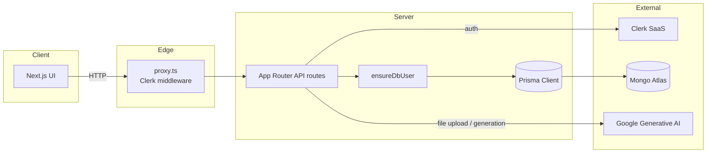
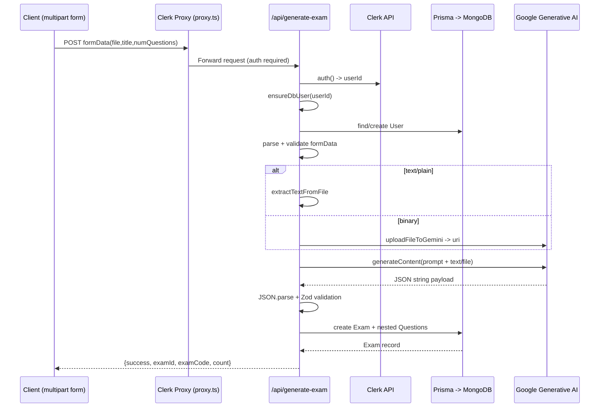

# API Review

## Stack Overview

- **Framework**: Next.js App Router route handlers under `app/api`.
- **Auth**: Clerk with a global `proxy.ts` guard. All routes (including API) are private except `/sign-in`, `/sign-up`, `/join`, and `/exam/[code]`.
- **Database**: MongoDB accessed through Prisma (`prisma/schema.prisma`). Prisma Client is generated into `app/generated/prisma` and consumed via `lib/prisma.ts`.
- **AI Integration**: Google Generative AI (Gemini) via `lib/google-ai.ts`, including file uploads through `GoogleAIFileManager`.



## Data Models (Prisma)

```17:72:prisma/schema.prisma
model User {
  id        String   @id @default(auto()) @map("_id") @db.ObjectId
  clerkId   String   @unique
  email     String   @unique
  name      String?
  image     String?
  createdAt DateTime @default(now())
  updatedAt DateTime @updatedAt
  exams       Exam[]
  submissions Submission[]
}

model Exam {
  id        String   @id @default(auto()) @map("_id") @db.ObjectId
  code      String   @unique
  title     String
  status    String   @default("DRAFT")
  authorId  String?  @db.ObjectId
  author    User?    @relation(fields: [authorId], references: [id])
  questions Question[]
  submissions Submission[]
  createdAt DateTime @default(now())
  updatedAt DateTime @updatedAt
}

model Question {
  id          String   @id @default(auto()) @map("_id") @db.ObjectId
  content     String
  options     Json
  correctIdx  Int
  explanation String?
  examId      String   @db.ObjectId
  exam        Exam     @relation(fields: [examId], references: [id], onDelete: Cascade)
  createdAt   DateTime @default(now())
  updatedAt   DateTime @updatedAt
}

model Submission {
  id          String   @id @default(auto()) @map("_id") @db.ObjectId
  answers     Json
  score       Float?
  timeSpent   Int?
  submittedAt DateTime @default(now())
  examId      String   @db.ObjectId
  userId      String   @db.ObjectId
  exam        Exam     @relation(fields: [examId], references: [id], onDelete: Cascade)
  user        User     @relation(fields: [userId], references: [id])
  createdAt   DateTime @default(now())
  updatedAt   DateTime @updatedAt
}
```

### Data Flow Notes
- Mongo ObjectIds are stored as strings and mapped via `@db.ObjectId`.
- `Exam.status` is stored as free-form `String` but the UI expects `"DRAFT" | "PUBLISHED" | "ENDED"`.
- Cascading deletes on `Question` and `Submission` ensure referential cleanup when an `Exam` is removed.

## Auth & User Provisioning

- `proxy.ts` replaces the deprecated `middleware.ts`. It wraps every request in `clerkMiddleware`, calling `auth.protect()` for all matcher paths except the explicitly public routes. This means API routes are authenticated by default; unauthenticated calls will be short-circuited before reaching handlers.
- `ensureDbUser` (`lib/ensure-db-user.ts`) is the bridge between Clerk identities and Mongo users. It:
  - Tries to `findUnique` by `clerkId`.
  - On cache miss, fetches the Clerk profile via `clerkClient().users.getUser`.
  - Creates a Prisma `User` record populated with email/name/image and returns it.
- Currently only `/dashboard` and `/api/generate-exam` call `ensureDbUser`. Plain `/api/exams` endpoints assume data already exists.

## API Route Breakdown

### POST `/api/generate-exam`



```34:244:app/api/generate-exam/route.ts
- Requires a signed-in Clerk session (enforced by proxy + explicit `auth()` check).
- Calls `ensureDbUser` to guarantee the author record exists.
- Accepts `multipart/form-data` with fields:
  - `file`: required; validated for MIME type & 20 MB limit via `uploadFileToGemini`.
  - `title`: required, trimmed.
  - `numQuestions`: optional, defaults to 10, constrained to [1, 50].
- File handling:
  - Plain text uses `extractTextFromFile`.
  - Other MIME types upload to Gemini File API and wait for the state to become `ACTIVE`.
- AI generation:
  - Dynamically imports `genAI`, builds a `gemini-1.5-flash` model with JSON output config, and sends either text inline or `{fileData}` references.
  - Prompt enforces language mirroring and MCQ structure.
  - Response text is parsed to JSON and validated against `AIResponseSchema` (enforces `{content, options[4], correctIdx, explanation}`).
- Persistence:
  - Generates an 8-char code (`XXXX-XXXX`) and retries until `prisma.exam.findUnique({ code })` is free. (Note: this loop isn’t atomic; concurrent requests could still collide.)
  - Creates the exam with nested `questions.create`.
- Response: `{ success: true, examId, examCode, questionsCount }` or `{ success: false, error }`.
- Errors from Gemini (e.g., invalid model `v1beta` 404) currently bubble up as 500 responses containing the message.
```

### `/api/exams`

```1:139:app/api/exams/route.ts
GET:
  - Optional `?status=` filter.
  - Returns all exams including questions and author summary, ordered newest-first.
POST:
  - Expects JSON `{ code, title, status?, authorId?, questions? }`.
  - Validates required `code` & `title`, checks for unique code.
  - Persists exam and creates nested questions using keys `{ text, options, correctAnswer }`.
```

**Important mismatch**: Prisma’s `Question` model uses `{ content, correctIdx }`, but the POST mapper still references `{ text, correctAnswer }`. Without a transformer, this creates columns that do not exist and will throw runtime errors. The handler also lacks authentication/authorization checks beyond the global Clerk proxy, so any logged-in user can create exams/attach arbitrary `authorId`.

### `/api/exams/[id]`

```1:186:app/api/exams/[id]/route.ts
GET:
  - Fetches one exam by Mongo id, including ordered questions and author info.
PATCH:
  - Accepts `{ title?, status?, code? }`.
  - Ensures the exam exists, validates code uniqueness, then updates fields.
DELETE:
  - Guards against missing exam, then deletes. Cascades remove questions automatically; submissions also cascade via schema.
```

All handlers rely on route params typed as `Promise<{ id: string }>` (App Router convention) and respond with `{ success, data?/message?/error }`.

## External Service Integration

- **Gemini File API**: Uploads convert Node `Buffer` via `arrayBuffer()` of the `File`. The helper polls `fileManager.getFile` until state transitions off `PROCESSING`. Failures throw descriptive errors.
- **Gemini GenerateContent**: Uses `model.generateContent` with either inline text or `fileData`. API version is `v1beta`; logs show 404 when the requested model isn’t available under that version. Consider downgrading to `gemini-1.5-flash-latest` or updating the SDK config.
- **Clerk**: `auth()` provides `{ userId }` inside API routes. `clerkClient()` is only used inside `ensureDbUser`.

## Observations & Potential Follow-ups

- `POST /api/exams` question payload needs to be aligned with the Prisma schema (`content` + `correctIdx`). Otherwise the handler will throw “Unknown arg `text`” errors.
- No ownership checks: any authenticated user can read/update/delete any exam record, regardless of `authorId`. Consider scoping by `authorId === currentUser.id`.
- Code uniqueness for generated exams relies on sequential lookups. A unique index already exists at the DB level; handling the `P2002` Prisma error would be safer than looping in userland.
- AI error handling is broad; user-facing errors expose upstream details (e.g., “[404 Not Found] models/gemini-1.5-flash”). Map known errors to friendlier messages.
- `ensureDbUser` isn’t used everywhere (e.g., manual `POST /api/exams`). If those routes remain authenticated, either call `ensureDbUser` or document the expectation that a user already exists.
- Proxy matcher currently protects every API route. If public endpoints (e.g., students joining exams) are required later, add them to `isPublicRoute` and ensure DB reads don’t leak private data.

This review should serve as the baseline for future refactors: aligning data contracts, tightening authorization, and handling AI/Clerk edge cases will make the platform more resilient.

